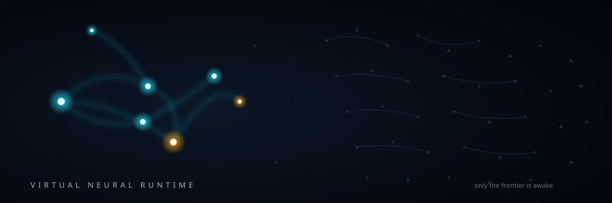
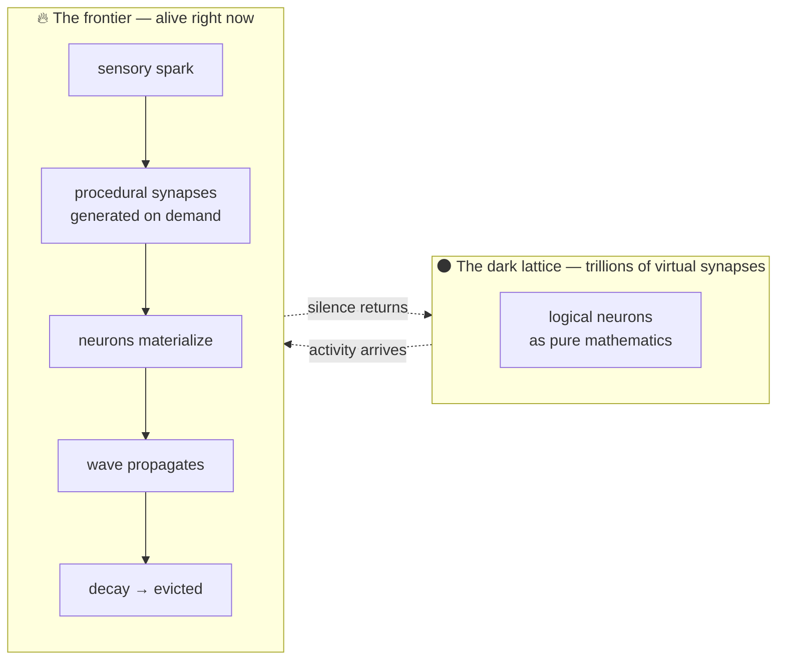
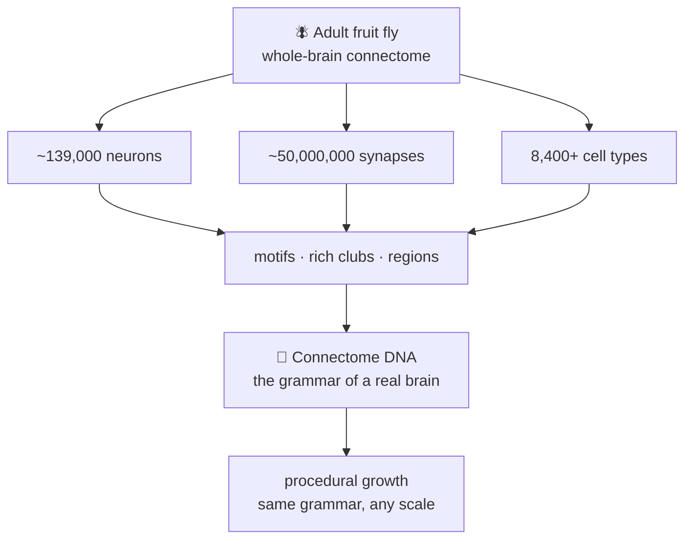
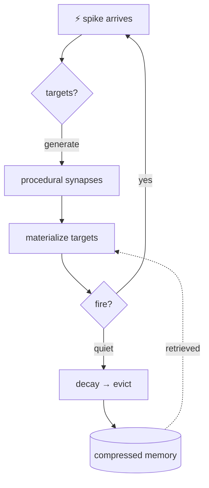
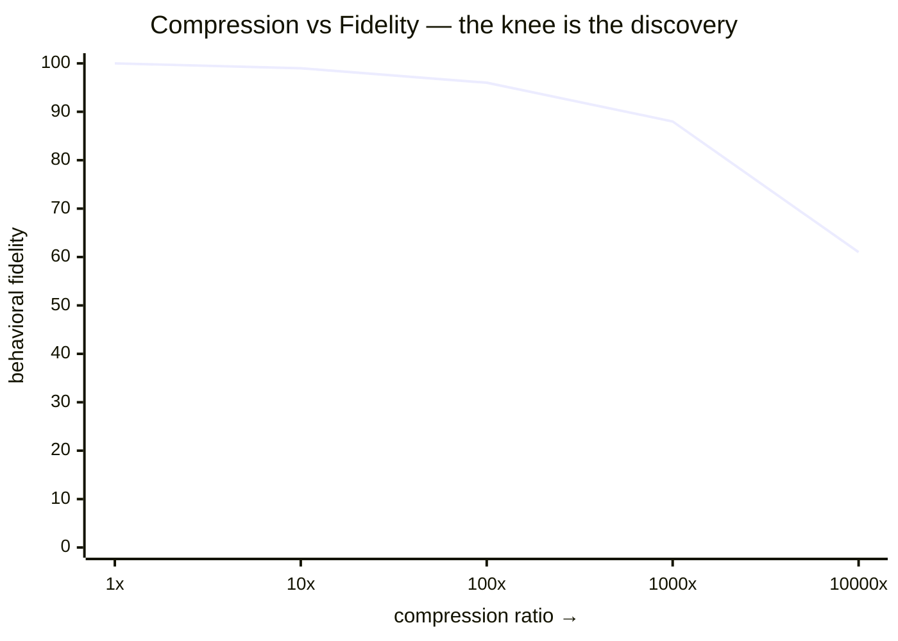

<div align="center">



# 🧠 Brain

### *A brain-scale neural system that lives on a normal computer — because it only ever wakes the part that is thinking.*

**Don't store the brain. Generate it. Don't simulate everything. Simulate what matters.**

</div>

---

Your laptop cannot hold a human brain. Nobody's can — the last team that tried needed a
supercomputer the size of a warehouse. So we stopped asking *"how do we fit the brain into
memory?"* and asked a better question:

> **What if most of the brain doesn't need to exist most of the time?**

A thought is not the whole brain firing. It is a *wave* — a small, bright cascade moving
through a vast dark lattice. The rest is silent. Waiting. And silence, it turns out, is
almost free.

**Brain** is built on that insight. It hosts a virtual neural system of staggering logical
scale, yet at any instant only a tiny *active frontier* is physically alive in memory. The
rest exists as mathematics: deterministic rules that can rebuild any neuron, any synapse,
at the exact moment activity reaches it — and release it the moment the wave passes.

Identity persists. Computation virtualizes. Like virtual memory, but for neurons.

---

## ✨ See it in your mind



Watch it happen: a stimulus lands, synapses bloom into existence along its path, neurons
flare and hand the signal forward, and behind the wavefront everything dissolves back into
equations. The machine is never calculating *everything*. It is calculating
**what the current thought is touching**.

---

## 🪰 Why a fly? Because it's the only brain we fully own

Somewhere in your head right now is a map you've never seen: all 86 billion neurons, still
uncartographed. But there is one animal whose *entire brain* humanity has completely mapped —
every neuron, every synapse, every cell type:



The fly connectome is our seed and our control. We extract its organizational grammar —
its motifs, its modules, its cell-type logic — and grow synthetic architectures from it at
any scale: 2×, 10×, 100×. And because the real fly stays in the lab as a control condition,
every claim is checkable. Random graphs, degree-matched graphs, motif-destroyed graphs all
run the same tasks. If fly-derived structure wins, we'll know exactly by how much — and if
it doesn't, that result ships too.

## ⚙️ Four principles, zero mysticism

| | Principle | What it means in practice |
|---|---|---|
| **1** | **Procedural connectivity** | Synapses are generated from rules at fire-time, never stored. The technique that put 4M neurons and 24B synapses on a single GPU. |
| **2** | **Event-driven execution** | Nothing updates on a clock. Computation happens when spikes arrive — sparse activity means sparse cost. |
| **3** | **Active-state virtualization** | Neurons materialize on demand from deterministic IDs and evaporate with hysteresis. Memory holds the wave, not the ocean. |
| **4** | **Hierarchical memory** | GPU holds the hot frontier · RAM holds warm populations and rules · disk holds compressed history. Hot → warm → cold, automatically. |



Learned things are never thrown away with the transient state — structure, long-term
memory, and momentary voltage live in separate layers, and important synapses get
*promoted* from procedural approximations into persistent explicit tracking. Forgetting
is engineered. Remembering is sacred.

## 🧪 The experiment at the heart of it

One graph rules this project. Every scale, every control, every task feeds a single plot:



Same seeds. Same stimuli. Same cognitive tasks — associative learning, reversal, working
memory, sequence prediction, ambiguity. Explicit dense networks versus sparse versus
procedural versus fully virtualized, each against its controls. Somewhere on that curve the
behavior breaks. **Finding the knee — and what determines it — is the entire scientific
program.** Everything else is scaffolding for that one discovery.

## 💬 And then… it speaks

A neural system that can think in latent states deserves more than a log file. So the
architecture grows a voice — with a boundary held sacred:

```mermaid
flowchart TD
    SENSE[🌍 environment] --> VNR[VNR neural core<br/>perception · memory · valuation · goals]
    VNR --> TEM[thought-event manager<br/>the BRAIN decides when<br/>something matters]
    TEM --> DEC[semantic decoder]
    DEC --> LLM[language renderer]
    LLM --> VOICE[🔊 speech]
    LLM -.->|never into| VNR
    VOICE -.->|feedback channel<br/>(explicit experiment only)| VNR
```

Nobody has to ask it anything. When novelty spikes, when prediction shatters, when a memory
surfaces — the system itself decides the moment is significant, renders its own internal
state into words, and speaks. *"That looks familiar."* *"Something changed."* *"I expected
the other one."* The screen beside it shows the causal chain: the neurons that fired, the
memory that activated, the threshold that crossed. Every word is traceable to a neural
event. The language model never thinks, never remembers, never pretends — it translates,
under the brain's direction, and the brain can switch it off.

## 🛠️ Built like an instrument, not a demo

- **Deterministic to the bone** — same seed, same brain, same thought. Bit-exact replays for static networks; statistical guarantees where plasticity flows.
- **Auditable scale** — every run reports its decomposition: how much is explicit, how much is population statistics, how much is procedural dream. No single-number theater.
- **Controls or it didn't happen** — random graphs, matched graphs, destroyed motifs. Structure earns its keep or gets cut.
- **Failure is data** — instability triggers pause, snapshot, and diagnosis. A null result that maps the boundary ships like any other.

```powershell
pip install -e .
vnr doctor        # hardware check: CPU · RAM · GPU · CUDA · dataset
pytest            # the oracle suite — everything must stay green
vnr simulate      # watch the frontier breathe
```

## 🌌 Where this goes

Today: a deterministic core that materializes and evicts neurons without changing behavior.
Tomorrow: the fly baseline reproduced, then expansions climbing the compression curve with
their controls. After that: cognitive tasks, latent thought decoding, a brain observatory
you can watch like weather — and finally a voice that speaks only when its own mind gives
it something worth saying.

The destination was never a chatbot with a brain visualization. It is a closed-loop
computational system whose internal states generate autonomous communication — with every
link in the causal chain visible on screen.

> *We didn't shrink the brain to fit the computer. We taught the computer to dream at the
> scale of a brain — and to wake only the part that is dreaming.*

---

<div align="center">

**MIT-licensed · Open science · Follow the journey right here as it compounds.**

*Hypotheses stay hypotheses. Observations stay observations. The knee will tell the truth.*

</div>
